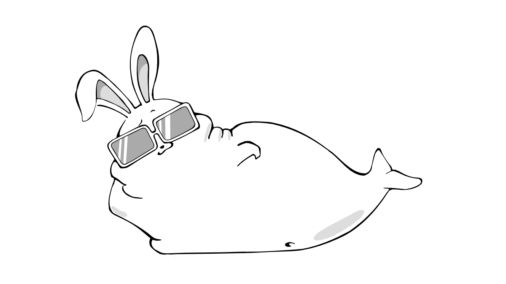



<h2>兵團簡介</h2>

Hi, 人類們，歡迎來到兔豚駐台辦事處。

兔豚這種生物對你來說或許很陌生，但是我對你們可是瞭若指掌。經過我們長期對人類的觀察，我們發現人類和兔豚的共通點就是<s>肥</s>永遠對新事物感到好奇，因此我們也樂於將結合新舊科技的全新體驗分享給大家，在台灣成立公司是我們滲透人類社會的第一步，就從征服你的眼球和感官開始!

Bunny Bunny!

<h2>駐台服務處</h2>

想連絡我們請透過我們的人類代表，接洽資訊如下：

<blockquote class="blockquote">
台北市大安區信義路四段25號5樓之二 
phone: 0925-926-119 
email: <a href="mailto:contact@seabunny.tech">contact@seabunny.tech</a>
</blockquote>

</img>


